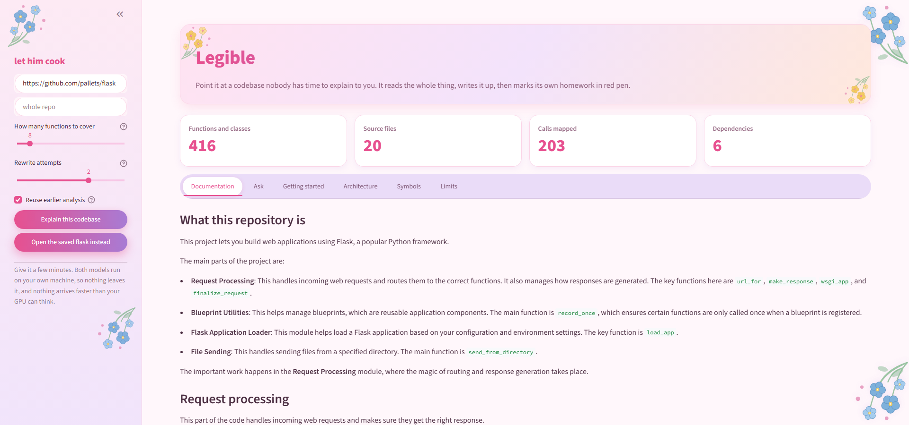

# Codex Sherpa

Point it at a codebase nobody has time to explain to you. It reads the whole
thing, writes it up, then marks its own homework in red pen.

Paste a GitHub URL, wait a few minutes, and get documentation for a repository
you have never seen: what it does, how it is laid out, what happens in what
order, and how to run it. Everything runs on your own machine.



## What makes it different

Plenty of tools will generate documentation. This one **checks its own output
before you read it**.

Every factual claim in the writing is extracted and verified against a call
graph built from the source. If the draft says `wsgi_app` calls
`full_dispatch_request`, that edge has to exist. If it does not, the sentence is
sent back and rewritten. What survives is what the code actually supports.

The model is never asked "is this correct?", because that just adds a second
opinion from the same kind of system that made the mistake. It is used to find
the claims. The call graph decides.

See it for yourself: [an example on Flask](docs/example-flask.md), and
[one on a TypeScript repo](docs/example-cordis.md). Both were generated by the
tool, and both carry the verification report they were judged by.

## What you get

- **A plain-English writeup** of what the project is and where the work happens
- **What happens, in order** — the main path through the code, taken from the
  real call chain rather than guessed at
- **Ask it anything** — questions answered from the actual source, with the
  answer checked before you see it, and a real test from the repo as an example
- **Getting started** — install steps, dependencies and entry points, read
  straight out of the repo's own files
- **What is rough about the code** — undocumented functions, private helpers
  nothing calls, circular imports, oversized functions

Python, JavaScript and TypeScript.

## What you need

- **Python 3.10+**
- **[Ollama](https://ollama.com)**, running locally
- **Two models**, about 5GB each:

```bash
ollama pull qwen2.5-coder:7b-instruct-q4_K_M
ollama pull qwen2.5:7b-instruct-q4_K_M
```

A GPU makes it about five times faster, but it works without one.

## Setup

```bash
python -m venv venv

# Windows
venv\Scripts\activate
# macOS / Linux
source venv/bin/activate

pip install -r requirements.txt
```

## Run it

```bash
streamlit run app.py
```

Paste a repo URL and press **Explain this codebase**. A first run takes a few
minutes: the models are local, and every claim is checked against the source.

Or from the command line:

```bash
python graph.py https://github.com/pallets/flask --top 8
python aggregator.py flask                       # assemble the document
python -m agents.answerer flask "how are session cookies signed?"
python selfcheck.py                              # ~180 offline checks
```

Some repositories hold more than one project. `--subdir` reads only part of one:

```bash
python graph.py https://github.com/unslothai/unsloth --subdir unsloth
```

## How it works

1. **Clone and parse.** tree-sitter turns every source file into a syntax tree,
   and a call graph is read off it. Who calls whom, never guessed.
2. **Rank.** Call-graph arithmetic decides what matters. No model involved, so
   it is cheap and repeatable.
3. **Describe.** A local model explains each important function, shown only real
   source.
4. **Write.** A second pass turns those notes into prose.
5. **Verify.** Claims are pulled out of the prose and checked against the graph.
   Failures are rewritten and re-checked, up to a limit.
6. **Assemble.** Diagrams, a symbol reference and a verification report, with no
   model involved at all.

## Honest limits

- Only the top-ranked functions are described, not the whole repository
- Roughly half of all calls go to third-party libraries and cannot be verified
- Anything decided at runtime is invisible to a syntax tree
- Only two kinds of claim are machine-checked: that A calls B, and that a symbol
  lives where the text says. Everything else in the prose is unverified
- Grouping is not checked, so a function can be described under the wrong
  component and still pass

Every generated document restates these with the numbers for that repository.

## How it is built

Ten stages, from cloning a repo to assembling the document. The reasoning
behind each one, and the bugs found along the way, are in
[docs/design-notes.md](docs/design-notes.md).
