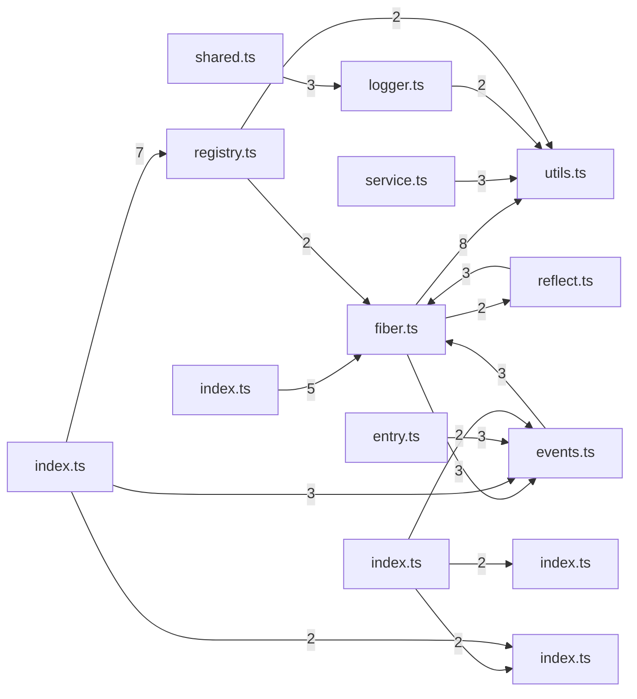

# cordis

*Generated by Legible. 8/8 sections machine-verified against 306 symbols and 220 verified calls; 45 claims checked.*

## Contents

1. [What this repository is](#what-this-repository-is)
2. [Fiber Management](#fiber-management)
3. [Utility Functions](#utility-functions)
4. [Event Handling](#event-handling)
5. [Reflection Utilities](#reflection-utilities)
6. [Plugin registration](#plugin-registration)
7. [File Writing](#file-writing)
8. [Where to start reading](#where-to-start-reading)
9. [Getting started](#getting-started)
10. [Architecture](#architecture)
11. [Symbol reference](#symbol-reference)
12. [Verification report](#verification-report)
13. [What this does not cover](#what-this-does-not-cover)

## What this repository is

This project helps you manage and handle events and effects in a structured way.

### Main Components

The project is split into several smaller parts:
- **Fiber Management** helps create and manage effects and check their active state.
- **Utility Functions** provide tools to check if a value is traceable or an object/function.
- **Event Handling** lets you register event listeners for specific events.
- **Reflection Utilities** notify fibers about updates based on certain conditions.
- **Plugin Registration** lets you register plugins and get a Fiber object in return.
- **File Writing** provides a debounced function to write files efficiently.

The important work happens in the `plugin` and `writeFile` functions, as they are the entry points for registering plugins and writing files, respectively.

## Fiber Management

This module helps manage effects and ensure a fiber is active.

First, `Fiber.effect` is called to create an effect. It takes an execute function and an optional label, then returns an `AsyncDisposable` to manage the effect. Next, `assertActive` is called to check if the fiber is active using its UID. If the fiber is inactive, it throws an error.

## Utility Functions

This part of the code helps figure out if a value can be traced or if it’s an object or function.

First, `getTraceable` checks if a given value is traceable. It uses `isObject` to determine if the value is an object or function. If it is, `getTraceable` uses `createTraceable` to make it traceable. If not, it just returns the original value.

## Event Handling

This module helps you set up event listeners in your application. When you want to listen for specific events, you use the `on` method.

First, you provide the name of the event and a function that will handle the event. The `on` method then checks if everything is active and calls the `register` function to add the listener. If there's an issue, it calls `bail` to stop the process. This ensures your application handles events smoothly and safely.

## Reflection Utilities

This part of the code is for notifying fibers about updates to specific names, but only if they pass a certain test.

`notify` is called with an array of names and an optional filter function. It then checks each name to see if it should be updated. If a name passes the filter, it calls `_checkImpl` to see if the name has changed. If it has, `_getImpl` is used to get the current state of the name. The result is an array of fibers that were updated.

## Plugin registration

This module is for registering plugins and returning a Fiber object.

First, the `RegistryService.plugin` method registers a new plugin. It takes three things: the plugin itself, an optional configuration, and an optional function to build the outer stack. After registering, it returns a Fiber object. This Fiber object helps manage the lifecycle of the plugin. The method also calls `assertActive` and `DisposableList` to ensure the plugin is active and to manage any disposable resources.

## File Writing

This module provides a debounced helper function for writing files, ensuring that the underlying `_writeFile` method is not called too frequently.

First, the `writeFile` method takes an array of `EntryOptions` objects. It then waits a short period (using `setTimeout`) before calling the `_writeFile` method. This debounce mechanism prevents the file from being written too often, which can be useful for optimizing performance or avoiding resource overload.

## Where to start reading

Start with `packages.core.src.utils.getTraceable` (line 110).

- `getTraceable` helps you understand how values are traced and converted, which is a common utility in the codebase. It determines if a value is traceable and returns the traceable version if it is.

Next, look at `packages.core.src.utils.isObject` (line 97).

- `isObject` checks if a value is an object or function. It's used by `getTraceable` to determine if a value is traceable.

Then, explore `packages.core.src.fiber.Fiber.effect` (line 277).

- `Fiber.effect` creates and manages an effect with a given execute function and label. It uses `isObject` and other helper functions to ensure the effect is properly managed.

Finally, read `packages.core.src.events.EventsService.on` (line 144).

- `EventsService.on` registers an event listener for a specified event name. It uses `isObject` and `getTraceable` to handle traceable values, ensuring that only relevant data is processed.

## Getting started

Taken directly from the repository's own files, not written by a model. Anything quoted below is quoted, not paraphrased.

### 1. Install it

<sub>inferred from package.json, the README gives no install command</sub>

```bash
npm install
```

A workspace monorepo. The dependencies below are packages/create/package.json, its largest package.

That pulls in `env-paths@^3.0.0`, `get-registry@^1.2.0`, `js-yaml@^4.1.1`, `kleur@^4.1.5`, `prompts@^2.4.2`, `tar@^7.5.10`, `which-pm-runs@^1.1.0`, `yargs-parser@^21.1.1`. Names you meet in the source that are not in the list above usually come from these.
<sub>from packages/create/package.json</sub>

### 2. Run it

<sub>from the scripts block in package.json</sub>

```bash
npm run build
npm run test
```

Those map to: `build` = `yarn yakumo esbuild && yarn yakumo tsc`, `test` = `yarn yakumo vitest --import tsx`

## Architecture

**What happens, in order.** The main path through this project, starting from the way in. The order comes from the real call graph.

1. **Notifies fibers about updates to specified names** — `notify`
2. **Emit** — `emit`, `_checkImpl`, `_refresh`
3. **Determines if a value is traceable** — `getTraceable`, `_setEpoch`
4. **Determines if a value is an object** — `isObject`, `_reload`, `_unload`
5. ** execute** — `_execute`, `_getState`, `dispose`
6. **Safecollect** — `safeCollect`, `collect`

**Which files depend on which.** 18 relationships, with the number on each arrow counting how many calls cross that boundary. Read the heaviest arrows first: they are where the work flows.



**Down at the function level.** Starts from the most important functions and follows their real calls outwards. Every arrow was read off the source, not inferred by a model.

```mermaid
graph TD
    subgraph sg0["packages/core/src/events.ts"]
        n_packages_core_src_events_EventsService_on["EventsService.on"]
        n_packages_core_src_events_EventsService_register["EventsService.register"]
    end
    subgraph sg1["packages/core/src/fiber.ts"]
        n_packages_core_src_fiber_Fiber_effect["Fiber.effect"]
        n_packages_core_src_fiber_Fiber_assertActive["Fiber.assertActive"]
        n_packages_core_src_fiber_Fiber__execute["Fiber._execute"]
        n_packages_core_src_fiber_Fiber_effect_dispose["effect.dispose"]
        n_packages_core_src_fiber_Fiber_constructor["Fiber.constructor"]
    end
    subgraph sg2["packages/core/src/logger.ts"]
        n_packages_core_src_logger_LoggerService_exporter["LoggerService.exporter"]
    end
    subgraph sg3["packages/core/src/reflect.ts"]
        n_packages_core_src_reflect_ReflectService_notify["ReflectService.notify"]
        n_packages_core_src_reflect_ReflectService_provide["ReflectService.provide"]
    end
    subgraph sg4["packages/core/src/registry.ts"]
        n_packages_core_src_registry_RegistryService_plugin["RegistryService.plugin"]
    end
    subgraph sg5["packages/core/src/utils.ts"]
        n_packages_core_src_utils_getTraceable["utils.getTraceable"]
        n_packages_core_src_utils_isObject["utils.isObject"]
        n_packages_core_src_utils_buildOuterStack["utils.buildOuterStack"]
    end
    subgraph sg6["packages/timer/src/index.ts"]
        n_packages_timer_src_TimerService__schedule["TimerService._schedule"]
    end
    n_packages_core_src_events_EventsService_on --> n_packages_core_src_events_EventsService_register
    n_packages_core_src_events_EventsService_on --> n_packages_core_src_fiber_Fiber_assertActive
    n_packages_core_src_events_EventsService_register --> n_packages_core_src_fiber_Fiber_effect
    n_packages_core_src_fiber_Fiber__execute --> n_packages_core_src_utils_isObject
    n_packages_core_src_fiber_Fiber_constructor --> n_packages_core_src_fiber_Fiber_effect
    n_packages_core_src_fiber_Fiber_effect --> n_packages_core_src_fiber_Fiber__execute
    n_packages_core_src_fiber_Fiber_effect --> n_packages_core_src_fiber_Fiber_assertActive
    n_packages_core_src_fiber_Fiber_effect --> n_packages_core_src_fiber_Fiber_effect_dispose
    n_packages_core_src_fiber_Fiber_effect --> n_packages_core_src_utils_buildOuterStack
    n_packages_core_src_fiber_Fiber_effect --> n_packages_core_src_utils_isObject
    n_packages_core_src_fiber_Fiber_effect_dispose --> n_packages_core_src_utils_isObject
    n_packages_core_src_logger_LoggerService_exporter --> n_packages_core_src_fiber_Fiber_effect
    n_packages_core_src_reflect_ReflectService_provide --> n_packages_core_src_fiber_Fiber_effect
    n_packages_core_src_reflect_ReflectService_provide --> n_packages_core_src_reflect_ReflectService_notify
    n_packages_core_src_registry_RegistryService_plugin --> n_packages_core_src_fiber_Fiber_assertActive
    n_packages_core_src_utils_getTraceable --> n_packages_core_src_utils_isObject
    n_packages_timer_src_TimerService__schedule --> n_packages_core_src_fiber_Fiber_effect
```



## Symbol reference

| Symbol | Kind | Role | Location | Purpose |
| --- | --- | --- | --- | --- |
| `effect` | method | shared helper | `packages/core/src/fiber.ts:277` | Creates and manages an effect with a given execute function and label. |
| `on` | method | shared helper | `packages/core/src/events.ts:144` | Registers an event listener for a specified event name. |
| `getTraceable` | function | shared helper | `packages/core/src/utils.ts:110` | Determines if a value is traceable and returns the traceable version if it is. |
| `isObject` | function | shared helper | `packages/core/src/utils.ts:97` | Determines if a value is an object or function. |
| `notify` | method | shared helper | `packages/core/src/reflect.ts:205` | Notifies fibers about updates to specified names, filtering based on a provided function. |
| `plugin` | method | shared helper | `packages/core/src/registry.ts:193` | Registers a plugin and returns a Fiber object. |
| `writeFile` | method | shared helper | `packages/include/src/index.ts:205` | Debounces the execution of the `_writeFile` method to ensure it is not called too frequently. |
| `assertActive` | method | shared helper | `packages/core/src/fiber.ts:224` | Checks if the fiber is active by verifying its UID. Throws an error if the fiber is inactive. |

## Verification report

Every factual claim in this document was pulled out of the prose and checked against the call graph built from the source. What follows is the honest tally, including the claims that could not be settled either way.

- **8/8 sections verified**
- **45 claims checked** across 8 sections
- **0 unresolved errors**, 3 unverifiable claims

| Section | Result | Claims | Errors |
| --- | --- | --- | --- |
| What this repository is | verified | 8 | 0 |
| Fiber Management | verified | 4 | 0 |
| Utility Functions | verified | 4 | 0 |
| Event Handling | verified | 4 | 0 |
| Reflection Utilities | verified | 8 | 0 |
| Plugin registration | verified | 6 | 0 |
| File Writing | verified | 3 | 0 |
| Where to start reading | verified | 8 | 0 |

### Not verifiable

Claims about code outside this repository, or phrasing the checker could not tie to a symbol. These are not errors, just unproven.

- 'Fiber.effect' is said to call 'execute function', which lives outside this repo, so it cannot be checked either way
- 'Fiber.effect' is said to call 'optional label', which lives outside this repo, so it cannot be checked either way
- 'assertActive' is said to call 'fiber', which lives outside this repo, so it cannot be checked either way

## What this does not cover

This tool is confident about a narrow set of things and vague about the rest. Here is the boundary, in numbers.

**Coverage**

- 8 of 306 functions and classes are described here. They were chosen by call-graph ranking, not by reading everything. The other 298 are real code this document never mentions.
- Non-Python files are not read at all, apart from the packaging files used for Getting started.

**What the call graph could not resolve**

- 220 calls were matched to a definition in this repository. 551 were not.
- Those go either to code outside this repository or to objects whose type cannot be worked out from the syntax alone (`Object`, `this`, `Reflect`, `console`, `kleur`). Absence of an arrow is not evidence that no call happens.
- 120 were dropped as ambiguous, where several definitions share a name and the correct one cannot be told apart without type inference.
- Anything decided at runtime is invisible here: dynamic dispatch, `getattr` lookups, callbacks passed as arguments, and registries filled in at import time.

- 2 file(s) had syntax the parser could only partly read.

**What the verification does not check**

- Only two kinds of claim are machine-checked: that one function calls another, and that a symbol lives where the text says. Everything else in the prose is unverified.
- Grouping is not checked. A function can be described under the wrong component and still pass.
- Nothing here tests behaviour. The document can be accurate about structure and still misdescribe what the code achieves.
- Whether the explanation is *useful* is not something a call graph can measure.
- 3 claim(s) in this document could not be checked either way. They are listed in the verification report as unverifiable.
