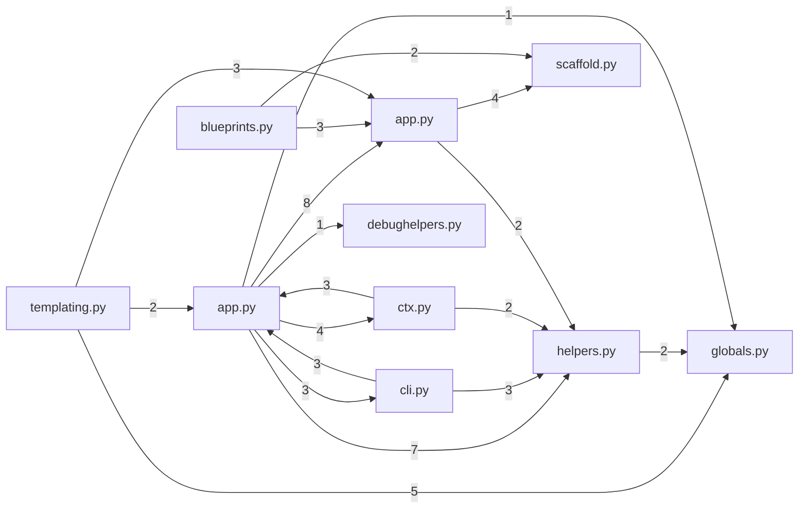
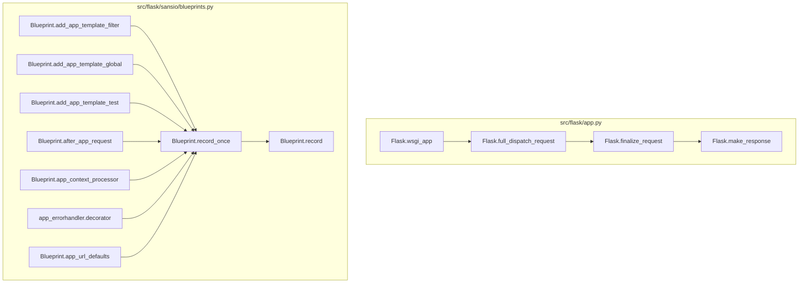

# flask

*Generated by Codex Sherpa. 6/6 sections machine-verified against 416 symbols and 203 verified calls; 39 claims checked.*

## Contents

1. [What this repository is](#what-this-repository-is)
2. [Request processing](#request-processing)
3. [Blueprint utilities](#blueprint-utilities)
4. [Flask Application Loader](#flask-application-loader)
5. [File Sending](#file-sending)
6. [Where to start reading](#where-to-start-reading)
7. [Getting started](#getting-started)
8. [Architecture](#architecture)
9. [Symbol reference](#symbol-reference)
10. [Verification report](#verification-report)
11. [What this does not cover](#what-this-does-not-cover)

## What this repository is

This project lets you build web applications using Flask, a popular Python framework.

The main parts of the project are:

- **Request Processing**: This handles incoming web requests and routes them to the correct functions. It also manages how responses are generated. The key functions here are `url_for`, `make_response`, `wsgi_app`, and `finalize_request`.

- **Blueprint Utilities**: This helps manage blueprints, which are reusable application components. The main function is `record_once`, which ensures certain functions are only called once when a blueprint is registered.

- **Flask Application Loader**: This module helps load a Flask application based on your configuration and environment settings. The key function is `load_app`.

- **File Sending**: This handles sending files from a specified directory. The main function is `send_from_directory`.

The important work happens in the **Request Processing** module, where the magic of routing and response generation takes place.

## Request processing

This part of the code handles incoming web requests and makes sure they get the right response.

First, `wsgi_app` processes the request. It handles it through middleware before sending it to the appropriate view function. If something goes wrong, it catches the exception.

Next, `full_dispatch_request` takes over. It handles the request before and after it’s processed, catches any errors, and finalizes the response.

Then, `finalize_request` makes sure the view function’s return value is turned into a proper response. It also applies any postprocessing functions.

Finally, `make_response` converts the view function’s return value into a Flask response object.

`url_for` helps by generating URLs for different endpoints.

## Blueprint utilities

This module helps ensure that certain functions are only called once when a blueprint is registered. When you register a blueprint in a Flask application, you might want to run some setup code just once. Here’s how it works:

First, you use the `record_once` method on a `Blueprint` object. This method wraps a function so that it runs only the first time the blueprint is registered. Next, when the blueprint is registered, the wrapped function is called. This ensures that your setup code runs exactly once, even if the blueprint is registered multiple times.

## Flask Application Loader

This module helps load a Flask application based on the settings and environment.

First, `ScriptInfo.load_app` is called to load the Flask app. It checks the configuration and environment to find the app. If no app is found, it raises a `NoAppException`. Next, it tries to locate the app using `locate_app`. If the app is a string, it imports it with `prepare_import`. Finally, it sets the debug flag with `get_debug_flag` and returns the app instance.

## File Sending

This part of the code is for sending files from a specified directory using Flask's `send_file` function.

First, `send_from_directory` is called with a directory path and a file path. It prepares the necessary arguments by calling `_prepare_send_file_kwargs`. Then, `send_file` is used with these prepared arguments to send the file. The result is a response object that can be sent back to the client.

## Where to start reading

Start with `flask.app.Flask.wsgi_app` in `src/flask/app.py`.

1. Open `flask.app.Flask.wsgi_app` to understand how Flask processes incoming web requests. This method is like the traffic controller for your application, directing requests to the right place.
2. Next, look at `flask.app.Flask.full_dispatch_request`. This method handles the main work of processing the request, including dealing with exceptions and finalizing the response.
3. Finally, review `flask.app.Flask.url_for`. This method helps you generate URLs for your application, making it easier to link to different pages.

By starting with `wsgi_app`, you'll see how Flask handles incoming requests. Then, `full_dispatch_request` will help you understand the flow of request processing, and `url_for` will show you how to generate URLs within your application.

## Getting started

Taken directly from the repository's own files, not written by a model. Anything quoted below is quoted, not paraphrased.

### 1. Check your Python version

This project needs Python `>=3.10`.

```bash
python --version
```

### 2. Install it

<sub>inferred from the package name in pyproject.toml, the README gives no install command</sub>

```bash
pip install Flask
```

That pulls in `blinker>=1.9.0`, `click>=8.1.3`, `itsdangerous>=2.2.0`, `jinja2>=3.1.2`, `markupsafe>=2.1.1`, `werkzeug>=3.1.0`. Names you meet in the source that are not in the list above usually come from these.
<sub>from pyproject.toml</sub>

### 3. Run the smallest thing that works

<sub>quoted from README.md</sub>

```python
# save this as app.py
from flask import Flask

app = Flask(__name__)

@app.route("/")
def hello():
    return "Hello, World!"
```

### 4. Know the ways in

- `flask` on your command line runs `flask.cli:main`
- `src/flask/__main__.py` can be run directly
- `src/flask/cli.py` can be run directly

### 5. Check your setup is sound

The project ships tests, which is the quickest way to find out whether it works on your machine before you blame your own code.

```bash
pytest
```

## Architecture

**What happens, in order.** The main path through this project, starting from the way in. The order comes from the real call graph.

1. **Handles a WSGI request** — `wsgi_app`
2. **Dispatches a request** — `full_dispatch_request`, `handle_exception`, `request_context`
3. **Finalizes a request** — `finalize_request`, `dispatch_request`, `handle_user_exception`
4. **Converts a view function's return value** — `make_response`, `handle_http_exception`, `make_default_options_response`
5. **Is null session** — `is_null_session`

**Which files depend on which.** 18 relationships, with the number on each arrow counting how many calls cross that boundary. Read the heaviest arrows first: they are where the work flows.



**Down at the function level.** Starts from the most important functions and follows their real calls outwards. Every arrow was read off the source, not inferred by a model.



## Symbol reference

| Symbol | Kind | Role | Location | Purpose |
| --- | --- | --- | --- | --- |
| `record_once` | method | shared helper | `src/flask/sansio/blueprints.py:232` | Wraps a function to ensure it is only called once when the blueprint is registered on an application. |
| `url_for` | method | entry point | `src/flask/app.py:1105` | Generates a URL for a given endpoint with specified values. |
| `load_app` | method | shared helper | `src/flask/cli.py:333` | Loads a Flask application based on configuration and environment settings. |
| `make_response` | method | supporting | `src/flask/app.py:1227` | Converts a view function's return value into an instance of Flask's response class. |
| `send_from_directory` | function | supporting | `src/flask/helpers.py:543` | Sends a file from within a specified directory using `send_file`. |
| `wsgi_app` | method | orchestrator | `src/flask/app.py:1569` | Handles a WSGI request by processing it through middleware and dispatching it to the appropriate view funct… |
| `finalize_request` | method | supporting | `src/flask/app.py:1024` | Finalizes a request by converting its return value into a response and applying postprocessing functions. |
| `full_dispatch_request` | method | orchestrator | `src/flask/app.py:995` | Dispatches a request, handling pre and post-processing, exceptions, and finalization. |

## Verification report

Every factual claim in this document was pulled out of the prose and checked against the call graph built from the source. What follows is the honest tally, including the claims that could not be settled either way.

- **6/6 sections verified**
- **39 claims checked** across 6 sections
- **0 unresolved errors**, 7 unverifiable claims

| Section | Result | Claims | Errors |
| --- | --- | --- | --- |
| What this repository is | verified | 12 | 0 |
| Request processing | verified | 10 | 0 |
| Blueprint utilities | verified | 3 | 0 |
| Flask Application Loader | verified | 5 | 0 |
| File Sending | verified | 3 | 0 |
| Where to start reading | verified | 6 | 0 |

### Not verifiable

Claims about code outside this repository, or phrasing the checker could not tie to a symbol. These are not errors, just unproven.

- 'wsgi_app' is said to call 'middleware', which lives outside this repo, so it cannot be checked either way
- 'wsgi_app' is said to call 'view function', which lives outside this repo, so it cannot be checked either way
- 'full_dispatch_request' is said to call 'view function', which lives outside this repo, so it cannot be checked either way
- 'finalize_request' is said to call 'view function', which lives outside this repo, so it cannot be checked either way
- 'finalize_request' is said to call 'postprocessing functions', which lives outside this repo, so it cannot be checked either way
- 'make_response' is said to call 'view function', which lives outside this repo, so it cannot be checked either way
- 'send_file' is said to call 'prepared arguments', which lives outside this repo, so it cannot be checked either way

## What this does not cover

This tool is confident about a narrow set of things and vague about the rest. Here is the boundary, in numbers.

**Coverage**

- 8 of 416 functions and classes are described here. They were chosen by call-graph ranking, not by reading everything. The other 408 are real code this document never mentions.
- 59 of 83 Python files were skipped before analysis even started: tests, docs, examples and build directories.
- Non-Python files are not read at all, apart from the packaging files used for Getting started.

**What the call graph could not resolve**

- 203 calls were matched to a definition in this repository. 336 were not.
- Those go either to code outside this repository or to objects whose type cannot be worked out from the syntax alone (`os`, `click`, `ctx`, `importlib`, `app`). Absence of an arrow is not evidence that no call happens.
- 56 were dropped as ambiguous, where several definitions share a name and the correct one cannot be told apart without type inference.
- Anything decided at runtime is invisible here: dynamic dispatch, `getattr` lookups, callbacks passed as arguments, and registries filled in at import time.

**What the verification does not check**

- Only two kinds of claim are machine-checked: that one function calls another, and that a symbol lives where the text says. Everything else in the prose is unverified.
- Grouping is not checked. A function can be described under the wrong component and still pass.
- Nothing here tests behaviour. The document can be accurate about structure and still misdescribe what the code achieves.
- Whether the explanation is *useful* is not something a call graph can measure.
- 7 claim(s) in this document could not be checked either way. They are listed in the verification report as unverifiable.
